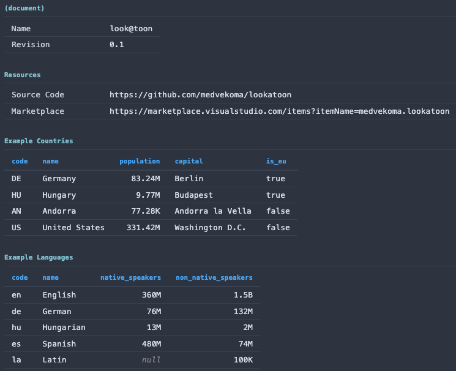

# look@toon - VS Code TOON viewer

A VS Code extension that renders [`.toon` files](https://github.com/toon-format/spec) as interactive tables instead of raw text.

## Features

- Displays each TOON table section as a formatted HTML table
- Displays top-level scalar values as a properties table
- Right-aligns numeric and formatted-number columns (e.g. `3.3M`, `77.7K`)
- Renders `null` values as muted italic `null`
- Handles all valid TOON value types: strings, numbers, booleans, null
- Adapts to your VS Code color theme (light, dark, high-contrast)
- Shows a clear error message when a file cannot be parsed

## Example

Here's a sample `.toon` file:

```text
Name: look@toon
Revision: 0.1
Resources:
  Source Code: https://github.com/medvekoma/lookatoon
  Marketplace: https://marketplace.visualstudio.com/items?itemName=medvekoma.lookatoon
Example Countries[4]{code,name,population,capital,is_eu}:
  DE,Germany,83.24M,Berlin,true
  HU,Hungary,9.77M,Budapest,true
  AN,Andorra,77.28K,Andorra la Vella,false
  US,United States,331.42M,Washington D.C.,false
Example Languages[5]{code,name,native_speakers,non_native_speakers}:
  en,English,360M,1.5B
  de,German,76M,132M
  hu,Hungarian,13M,2M
  es,Spanish,480M,74M
  la,Latin,null,100K
```

How it looks in look@toon:



## Usage

Open any `.toon` file — the table view activates automatically.

To switch back to the raw text editor: right-click the tab → **Reopen Editor With…** → select the default text editor.

## Developer Support

### Build & Install

```bash
npm install
npm run package
# Update .vsix file name if needed
code --install-extension lookatoon-0.1.2.vsix
```

### Requirements

VS Code 1.74 or later.

### License

MIT
